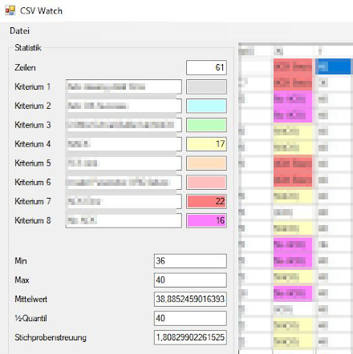

# CsvWatch

Tool, privately developed to view txt or csv files as a table, to get 
statistics for a (double click into column) column with numbers and 
to count and mark cells of a column if certain comma separated terms 
appear (double click on color text field).

This is a hacky beta version. Main focus on building cSharp with msbuild
and running the exe with mono (Linux or Rasperry Pi 1).

## Load Config

I know, it will be more effective, to store additional column numbers and color
codes for each criteria and "process" them after loading the config. Please 
note that it is an kick-ass development of a simple tool. Many possible input,
usability and data problems are therefore ignored. **Before more features** are 
added at this point, a **useful error output** would have to be implemented NOW.